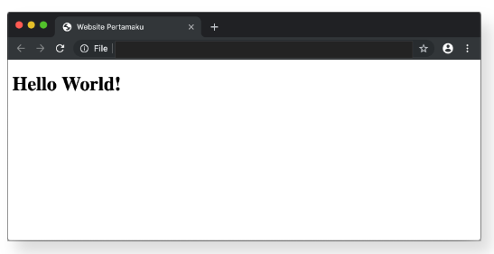
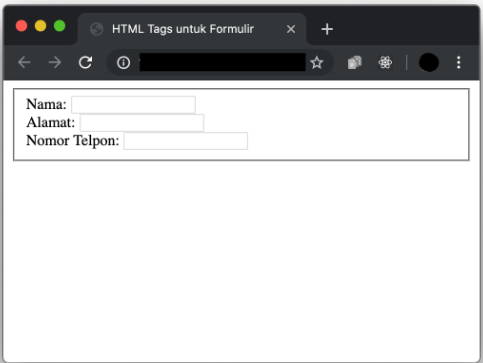
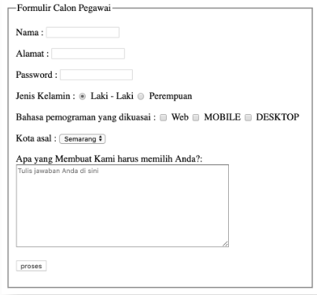
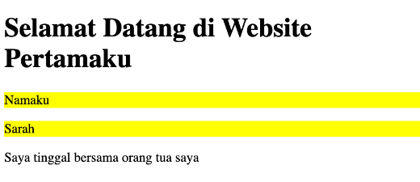

# __Writing and Presentation Test Week 1__
## __Unix Command Line__
<hr>


- Shell adalah Program yang menerima perintah kita kemudian meneruskan perintah tersebut untuk dieksekusi oleh sistem.(ialah program yang digunakan untuk berkomunikasi atau memerintah sistem)
- Command Line Interface adalah  Shell yang berbasis Teks
- Contoh Command Line Interface : sh,bash,zsh,cmd.exe
- Untuk Mengakses sebuah CLI bisa menggunakan program Terminal Emulator, Command Prompt, Power Shell
-  Fungsi CLI : Membuat Otomasi, Menjalankan program command-line, Menggunakan development tools
-  Shell Prompt ialah tempat kita memasukkan perintah/command
- Cara mengakses CLI menggunakan program Terminal :
    - Dollar Sign ($) disebut Shell Prompt
    - Dollar Sign ($) akan muncul ketika shell sudah siap menerima input
    - Di bash jika karakter terakhir dari prompt-nya adalah Hash Mark (#) berarti kita punya hak Super user

- Penulisan Command -> command -options argument
    - command -> adalah perintah yang akan diberikan
	- options -> adalah keterangan tambahan terkait perintah yang di berikan
	- argument -> adalah nilai yang diberikan sebagai bagian dari perintah

-  Perintah untuk melihat penjelasan dan penggunaan dari suatu command -> man nama_command

- Filesystem (ialah sebuah cara bagaimana sistem operasi mengatur dan mengorganisir file dan direktori)

- Filesystem  
    - Sebuah mengatur bagaimana data disimpan didalam sebuah system
    -  Sistem operasi Windows & Unix-like menyusun file dan direktori menggunakan struktur yang bentuknya mirip tree.

- Root Directory ialah direktori paling atas (tinggi)

- Working Directory ialah direktori yang aktif saat ini dan bisa digunakan untuk bekerja

- pwd (Print Working Directory) : Command untuk melihat current working directory

- ls (Lists) : Command untuk melihat isi file yang ada di sebuah direktori
	- ls -a (untuk melihat folder dan file yang hidden)
	-> ls -l (untuk melihat isi dari sebuah direktori dalam bentuk long format)
	- ls -al (kedua perintah diatas bisa digabung)

- Pada sistem operasi mirip UNIX, file atau direktori yang hidden dicirikan dengan titik (.) di awal nama file atau direktori

- cd 
    - ```<direktori>``` (Change Directory) Command untuk berpindah direktori
	- cd .. (untuk back atau naik ke directory di atas satu kali)

- head 
    - Command untuk melihat beberapa line awal dari sebuah file text
	- head -5 namafile atau head -n 5 namafile (untuk melihat 5 line dari sebuah file)
	-> head -1 namafile1 namafile2 (untuk melihat priview dari 2 file sekaligus)

- tail 
    - Command untuk melihat beberapa line akhir dari sebuah file text
    - penggunaan hampir sama seperti head

- cat 
    - Command untuk melihat seluruh isi sebuah file
	- juga bisa membuka beberapa file sekaligus
	- cat namafile1 namafile2

- touch 
    - Command untuk membuat sebuah file
	- bisa membuat beberapa file sekaligus
	- touch namafile1 namafile2

- mkdir : Command untuk membuat sebuah direktori

- cp 
    - Command untuk mengcopy files atau directory
	- cp namafile target/namafile
	- cp -r namadirektori targetdirektori (untuk mengcopy sebuah direktori)

- mv 
    - (move) Command untuk memindahkan files atau directory. Bisa digunakan untuk rename.
	- mv namafile/direktorilama namafile/direktoribaru (untuk mengubah sebuah file/direktori)

- rm 
    - (remove) Command untuk menghapus file atau directory
	- rm -i namafile (untuk menghapus file dan mendapatkan peringatan)
	-> rm -d namadirektori (untuk menghapus direktori kosong)
	-> rm -r namadirektori (untuk menghapus sebuah direktori beserta file di dalamnya)
	-> rm -rf namadirektori (Untuk menghapus direktori tanpa diminta konfirmasi)

- nano namafile (untuk buka file, lalu mengisi file tersebut, kalau di GUI biasa yaitu notepad)


<hr>

 ## __Git&GitHub__ 

 - Git adalah aplikasi yang dapat melacak setiap perubahan yang terjadi pada suatu folder atau file.
- Git berfungsi sebagai Version Control System
- Version Control System  ialah mencatat setiap perubahan pada File (termasuk code yang kita buat) pada suatu proyek baik dikerjakan secara individu maupun tim.
- File -file yg disimpan menggunakan git akan terlacak seluruh perubahannya, termasuk siapa yang mengubah.
- Keuntungan Menggunakan Git dan GitHub
    - Bisa berkolaborasi mengerjakan proyek yang sama tanpa harus repot copy paste folder aplikasi yang terupdate.
    - Tidak perlu menunggu rekan dalam satu tim kita menyelesaikan suatu program dahulu untuk berkolaborasi.
     - Bisa membuat file didalam projek yang sama atau membuat code di file yang sama dan menyatukannya saat sudah selesai.
- Perbedaan Git dan GitHub
    Git adalah sebuah software atau tools yang digunakan untuk melakukan manajemen versi pada sebuah project.
    sedangkan GitHub adalah cloud based hosting service tempat kita menyimpan Git Repository.
- Langkah-langkah git di local area
    - git init -> perubahan -> git status -> git add . -> git commit -m "nama/pesan dari perubahan" -> git remote (hanya dilakukan sekali, jika sudah pernah dilakukan bisa skip langsung ke step selanjutnya) -> git push
    - git init namafolder` -> digunakan untuk membuat sebuah repository
    - git init .` -> bisa digunakan jika folder sudah ada
- git status` :
 untuk melihat status dari sebuah repository
 - Ada 3 status dalam git :
     1. Modified adalah kondisi dimana revisi atau perubahan sudah dilakukan, tetapi belum ditandai (untracked) dan belum disimpan dalam version control.
    2. Staged adalah kondisi dimana revisi sudah ditandai (modified) namun belum disimpan di version control.
     3. Commit/committed adalah kondisi dimana revisi sudah disimpan pada version control.

- `git add .` : untuk menandai semua file dan menyimpan semua perubahan, dan untuk mengubah status untrackted file dan unmodified menjadi modified.
 
- `git commit` : untuk save perubahan pada version control
-  `git checkout` : untuk membatalkan perubahan, belum stagged dan belum commited
- `git revert` : untuk membatalkan semua perubahan yang ada tanpa menghapus commit terakhir
- `git reset` : untuk membatalkan semua perubahan yang ada tetapi commit terakhir akan terhapus
- `git branch` : untuk membuat percabangan pengerjaan, agar meminimalisir konflik code saat pengerjaan.
- `git merge` : untuk menyatukan branch cabang fitur yang telah dikembangkan sebelumnya ke branch utamanya.

 <hr>


 ## __HTML__
 1. ### __Pengertian__ 
 - HTML adalah bahasa komputer yang digunakan untuk membuat kerangka atau struktur untuk Web pages (halaman website) di internet.

- HTML adalah singkatan dari Hyper Text Markup Language.
- Fungsi HTML adalah sebagai 'kerangka', yang memberi struktur pada website.

2. ### __HTML Tag, Element, Attribute dan Comment__

-  #### __HTML Tag__
   
- HTML terdiri dari komponen yang disebut HTML Tag.

    
       Pada umumnya, ada 2 tipe HTML Tag :

    1. Opening Tag (tag pembuka) - contohnya adalah ```<p>```.
    2. Closing Tag (tag penutup) - contohnya adalah ```</p>```.
- Struktur Dokumen HTML

    Secara garis besar, struktur dokumen HTML dapat digambarkan sebagai berikut:

    

    Dokumen HTML memiliki 3 tag utama, yaitu ```<html>,<head>```, dan ```<body>```. 

    Ketiga tag tersebut harus diketik persis seperti contoh di bawah ini:

    ```
    <!DOCTYPE html>
    <html>
    <head>
     ...
    </head>
    <body>
     ...
    </body>
    </html>
    ```
    
    Penjelasan dari contoh di atas:

- ```<!DOCTYPE>``` syntax mendefinisikan versi dari HTML yang digunakan dan harus dideklarasi sebelum tag ```<html>. <!DOCTYPE html>```mendefinisikan bahwa dokumen ini adalah HTML5.

- ```<html></html>``` adalah root element dari halaman HTML. Semua HTML tag lainnya harus dibungkus dengan tag ini.

- ```<head>``` pada umumnya berisi ```<meta>, <title>```, konten css/js internal maupun link ke file css/js eksternal.

- ```<body>``` berisi konten website yang ingin ditampilkan pada browser.

    Nah, di bawah ini adalah contoh sederhana file HTML yang sudah memiliki title dan konten:
    ```
    <!DOCTYPE html>
    <html>
      <head>
        <title>Website Pertamaku</title>
      </head>
      <body>
        <h1>Hello World!</h1>
      </body>
    </html>
    ```
    Hasilnya 

    

    Perhatikan gambar di atas:

    - Element ```<title>``` Website Pertamaku ```</title>``` akan menghasilkan tulisan "Website Pertamaku" pada judul tab halaman browser
    - Element ```<h1>``` Hello World!  ```</h1> ```menghasilkan tulisan "Hello World!" sebagai konten pada file HTML kita.

2. #### __HTML Element__
- HTML Element merupakan sebuah komponen dalam halaman web, bisa berupa paragraf, judul, atau gambar.

    Struktur dari sebuah HTML element dapat digambarkan seperti ini:

    


    Pada umumnya, HTML Element terdiri dari:

    - Opening Tag (tag pembuka) - contohnya adalah ```<p>```.

    - Closing Tag (tag penutup) - contohnya adalah ```</p>```.

    - Attribute - contohnya adalah style yang memiliki Value ```"color=red"```.
    - Content (konten) yang ingin ditampilkan di browser - contohnya adalah``` My first paragraph.```
    
    Ada dua jenis HTML Element, yaitu:
    -   HTML Element yang memiliki Opening Tag (tag pembuka) dan Closing Tag (tag penutup) - contohnya adalah ```<p>``` dan ```</p>```.

    - Empty HTML Element: memiliki Self-closing Tag, yang hanya memiliki Opening Tag (tag pembuka) dengan garis miring sebelum kurung tutup - contohnya adalah ```<br />``` atau ``````.

3. #### __HTML Attribute__
- yang berfungsi untuk memberikan informasi tambahan kepada sebuah element.

    Contoh penggunaan attribute:
    ```
    <!--  adalah tag untuk memasukkan element gambar -->
    
    ```

    Pada kode di atas, tag `````` memiliki dua attribute:

- width yang berfungsi untuk menentukan lebar dari element gambar, dan diberikan value (nilai) lebar sebesar 80%

- src yang berfungsi untuk menentukan sumber gambar, dan diberikan value (nilai) untuk diarahkan ke tautan https://bit.ly/3laVBck

4. #### __HTML Comment__
- comment adalah catatan kecil yang bisa kita tambahkan ke dalam kode sumber (source code) tanpa mengubah fungsi dari program yang kita buat.

- Comment tidak hanya berguna bagi programmer lain, tetapi juga akan berguna bagi kita sebagai pembuatnya. Misalnya, bisa saja kalian lupa tentang fungsi kode yang kalian tulis di 3 bulan yang lalu.

- HTML comment diawali dengan ```<!-- dan diakhiri dengan -->.```

    Contohnya seperti ini:
    ```
    <html>
  <head>
    <title>Website Pribadiku</title>
  </head>
  <body>
     <header>
     ....
     </header>
    <!-- Paragraf di bawah ini dalam bahasa Latin -->
    <main>
      <p>
        Lorem, ipsum dolor sit amet consectetur adipisicing elit. Reiciendis porro deserunt voluptatum, itaque dolore alias, optio harum pariatur eveniet, quibusdam nostrum reprehenderit odio eius autem aperiam nobis quod maxime. Ipsam.
      </p>
        </main>
      </body>
    </html>
    ```

    

### __HTML Tag Untuk Menampilkan Teks__

1. #### __Heading__
    tag ini akan menampilkan struktur website kita. Bisa diumpamakan seperti tag ```<h1>``` sebagai judul bab pada sebuah buku, kemudian ```<h2>``` sebagai judul sub-bab.

    Tag heading hanya memiliki 6 tingkatan. Penulisannya seperti di bawah ini:
    ```
    <h1>Heading Satu</h1>
    <h2>Heading Dua</h2>
    <h3>Heading Tiga</h3>
    <h4>Heading Empat</h4>
    <h5>Heading Lima</h5>
    <h6>Heading Enam</h6>
    ```

    Hasilnya di browser akan seperti ini:

    

2. #### __Paragraf__
- Untuk membuat paragraf pada halaman website, maka dibutuhkan tag ```<p>```.
Penulisannya seperti ini:
    ```
    <p>
     Lorem ipsum dolor sit, amet consectetur adipisicing elit. Voluptate tempora
     provident quaerat officia maxime totam, repudiandae libero ducimus hic esse
    ipsam quam cum voluptates enim laudantium fugit quis eum suscipit.
    </p>
    ```
    Di browser, kode di atas akan terlihat seperti ini:

    


3. #### __Link/Anchor__
- Untuk membuat link pada halaman web, maka diperlukan tag ```<a>```. Tag ```<a>``` memiliki attribute href yang berguna untuk menyimpan link website yang dituju.

    Penggunannya seperti ini:
    ```
    <a href="https://google.com">Google</a>
    ```

4. #### __Span__
- Tag ```<span>``` digunakan untuk mengelompokkan tulisan dalam satu baris. Pada umumnya sering digunakan untuk menambahkan CSS pada suatu tulisan pada satu baris, tapi tidak menutup kemungkinan digunakan untuk hal lainnya.

    Contoh penggunaan:
    ```
    <p>Kucingku bermata <span style="color:blue"> biru</span></p>
    ```
    Contoh di atas akan muncul di browser seperti ini:

    

5. #### __Huruf Tebal__
- Tag ```<b>``` atau ```<strong>``` digunakan untuk membuat tulisan menjadi tebal.

    Contoh penggunaan:
    ```
    <p>
    Nama saya <b>Sarah</b>. Saya berumur <strong>22 tahun.</strong>
    </p>
    ```
    Contoh di atas akan terlihat di browser seperti ini:

    


6. #### __Huruf Miring__
- Untuk membuat huruf bercetak miring, maka dibutuhkan tag ```<i>``` atau ```<em>```.

    Contoh penggunaan:
    ```
    <p>
    Nama latin dari tanaman padi adalah <i>Oryza</i> <em>sativa L.</em>
    </p>
    ```
    Contoh di atas akan terlihat di browser seperti ini:

    

7. #### __List__
- Ada dua tipe list di HTML, yaitu:

    - Unordered list dengan menggunakan tag ```<ul>```
    - Ordered list dengan menggunakan tag ```<ol>```

    Masing-masing list baik ```<ul>``` atau ```<ol>``` memiliki element ```<li>``` untuk mendefinisikan nilai-nilai dari list tersebut.

    Contoh:

    ```
    <!-- Unordered List -->
    <ul>
    <li>Kopi</li>
    <li>Teh/li>
    <li>Susu</li>
    </ul>

    <!-- Ordered List -->
    <ol>
    <li>Kucing</li>
    <li>Anjing</li>
    <li>Ikan</li>
    </ol>
    ```

    Contoh di atas akan terlihat di browser seperti ini:

    

### __HTML Tag Untuk Multimedia__
1. #### __Gambar__
- Untuk menampilkan gambar pada halaman sebuah website, maka kita membutuhkan tag ``````.

    Contoh penggunaannya:
    ```
    
    ```
    Hasil dari kode di atas pada browser akan terlihat seperti ini:

    
2. #### __Video__ 
- Video Element

    untuk bisa menambahkan video pada halaman web kita; yaitu dengan menggunakan tag ```<video>```. Format video yang didukung antara lain: mp4, ogg, dan webM.

    Syntaxnya cukup simpel, seperti di bawah ini:
    ```
    <video width="320" height="240" src="link-ke-videonya"></video>
    ```
    atau dengan mengapit element ```<source>``` di antara element ```<video>``` seperti ini

    ```
    <video width="320" height="240">
    <source src="link-ke-video-nya" type="video/tipe-videonya"/>
    </video>
    ```

    Contoh penggunaannya:
    ```
    <video width="320" height="240">
    <source src="https://bit.ly/3j6rPni" />
    </video>
    ```
    Kita akan melihat hasilnya seperti ini
    
    
    tapi kok videonya tidak jalan? Dan tidak ada tombol play pula.

- Autoplay
Untuk memulai videonya secara otomatis. Kita bisa tambahkan attribute autoplay di dalam element ```<video>```-nya seperti ini

    ```
    <video width="320" height="240" autoplay>
    ```

    Dengan begitu videonya akan langsung dimulai sesaat setelah halaman web kita ditampilkan di browser.

- Controls
Bagaimana dengan tombol play atau pause-nya?

    Nah kalau kita ingin menambahkan tombol-tombol media tersebut, kita bisa tambahkan atribut controls seperti ini

    ```  
    <video width="320" height="240" controls>
    ```
    Sekarang ada tombol play, pause, dan fullscreen kan?

    
- Poster
Misalkan ukuran file video yang kita taruh itu besar dan membutuhkan waktu lama untuk di-load. Daripada hanya menampilkan layar hitam, kita bisa menyuruh element ```<video>``` untuk menampilkan sebuah gambar.

    Misalnya kita ingin menampilkan gambar seekor kucing selagi video kita di-load, kita bisa melakukannya seperti di bawah ini

    ```
    <video width="320" height="240" poster="https://skilvul-assets-01.s3-ap-southeast-1.amazonaws.com/lesson/intro-to-html/cat.jpeg" controls>
    <source src="https://bit.ly/2FKluzq" />
    </video>
    ```
    Sekarang dari ketika videonya di-load sampai kita memulai, akan ditampilkan gambar seekor kucing. Seperti thumbnail video.

    

- Fallback Video Format
ada beberapa format video yang didukung oleh HTML5. Masalahnya tidak semua browser mendukung format video yang sama:

    ada yang hanya mendukung mp4 seperti Internet Explorer dan Safari,
    ada juga yang mendukung semua format seperti Chrome dan Mozilla.
    Bagaimana mengatasi masalah ini?

    Kita bisa tambahkan beberapa element ```<source>``` di dalam ```<video>``` seperti ini
    ```
    <video width="800" height="600">
        <source src="link-ke-videonya" type="video/mp4" />
        <source src="link-ke-videonya" type="video/ogg" />
        <source src="link-ke-videonya" type="video/webm" />
    </video>
    ```
    Dengan begitu, andaikata browsernya tidak mendukung format mp4, dia akan beralih mencoba yang ada di bawahnya: yaitu ogg dan webm.

3. #### __Suara__
- HTML5 juga mendukung adanya element yang berisi suara/audio. Untuk menampilkan suara pada halaman sebuah website bisa menggunakan tag ```<audio>```. Format yang didukung pun meliputi mp3, wav, dan ogg.

    Syntax penulisannya juga ada dua seperti dengan tag ```<video>```:

    ```
    <audio controls src="link-ke-file-audio"></audio>
    ```

    Atau menggunakan tag ```<source>``` yang diapit tag ```<audio>```

    ```
    <audio controls>
        <source src="link-ke-file-audio" type="audio/tipe-audionya" />
    </audio>
    ```

- Fallback Audio Format

    Contoh penggunaannya bisa seperti ini:

    ```
    <audio controls>
    <source src="cat_meow.ogg" type="audio/ogg" />
    <source src="cat_meow.mp3" type="audio/mp3" />
     <source src="cat_meow.wav" type="audio/wav" />
     Your browser does not support the audio element.
    </audio>
    ```

    Lho itu kenapa ada banyak element ```<source>```-nya?

    Dengan adanya beberapa ```<source>``` dengan type yang berbeda-beda, apabila sebuah browser tidak mendukung file audio yang kita berikan, dia akan secara otomatis membaca file yang berikutnya. Jadi jika kita ingin semua fitur website kita bisa diakses semua orang, sebaiknya kita memberi beberapa jenis file audio; jaga-jaga apabila file audionya tidak didukung.

- Controls

    Kalau kalian coba kode yang tadi, kalian bisa lihat ada tombol medianya seperti play, pause, dan timeline audionya. Itu karena kita memberikan attribute controls ke dalam element ```<audio>```-nya.

- Loop

    Jika kita memberikan attribute loop di dalam element ```<audio>``` kita, suara yang dimainkan akan terus mengulang tiap kali selesai. Mungkin ini cocok untuk background music yang memang terus dimainkan tanpa henti selama pengguna terus berada di halaman web tersebut.

- Autoplay

    Dengan attribute autoplay, suara akan langsung dimainkan sesaat setelah halaman web selesai di-load. Seperti yang barusan kita bahas, mungkin attribute ini cocok untuk background music pada sebuah website yang tidak perlu dimainkan secara manual oleh pengguna.

4. Halaman Website Lainnya
- Kita juga bisa menampilkan halaman website lainnya di halaman website yang kita buat dengan menggunakan tag ```<iframe>```.

    Contoh penggunaannya adalah seperti ini:
    ```
    <iframe></iframe>
    ```

- Width dan Height

    Jadi halaman html yang lain itu akan diperlakukan sebagai sebuah element dalam struktur file HTML kita: bisa diatur tinggi-lebarnya juga dengan menambahkan attribute width dan height seperti ini:
    ```
    <iframe width="lebar iframe" height="tinggi iframe" ></iframe>
    ```

- Sumber Konten HTML

    ```<iframe>``` itu kan isinya konten HTML, kita bisa menambahkan attribute src untuk memberitahu konten apa yang harus ditampilkan.

    Cara menambahkan attribute src ke dalam ```<iframe>``` adalah seperti berikut:
    ```
    <iframe src="link-ke-konten-html"></iframe>
    ```
    Sekarang halaman web kita akan menampilkan halaman web lain di dalamnya.

    
        
- Scrolling

    Andaikata konten HTML yang kita masukkan ke dalam ```<iframe>``` kita itu lebih besar dari ukuran ```<iframe>```-nya sendiri, secara default akan ada scrollbar untuk scroll halamannya.

    Nah kita memiliki opsi untuk menghilangkan scrollbar tersebut dengan menambahkan attribute scrolling="no" di dalam ```<iframe>``` seperti ini:

    ```
    <iframe scrolling="no"></iframe>
    ```

- Frameborder

    Kalau kalian lihat, di bagian pinggir ```<iframe>``` akan ada pinggiran berwarna abu-abu bukan? Kalau kalian merasa itu jelek atau tidak rapi, kalian bisa menambahkan attribute frameborder="0" di dalam ```<iframe>```-nya seperti ini

    ```
    <iframe frameborder="0"></iframe>
    ```

    Untuk merangkum cara penggunaan semua attribute di ```<iframe>```, kita bisa melihat contoh berikut:
    ```
    <iframe src="https://bit.ly/32jR7ro" width="200" height="300" scrolling="no" frameborder="0"></iframe>
    ```

    Kode di atas akan menghasilkan ```<iframe>``` seperti berikut:

- sumber konten yang mengarah ke halaman https://bit.ly/32jR7ro

- lebar sebesar 200 dan tinggi sebesar 300

- tidak mempunyai scrollbar apabila konten HTML di dalamnya lebih besar dari ukuran ```<iframe>```

- tidak mempunyai border yang membungkus element ```<iframe>```

### HTML Tag Untuk Tabel 
    Pada dasarnya, untuk membuat sebuah tabel di HTML cukup membutuhkan tiga tag, yaitu:

1. ```<table>``` sebagai element utama.

2. ```<tr>``` atau dikenal sebagai table row tag, digunakan untuk membuat baris baru di dalam ```<table>```.

3. ```<td>``` atau dikenal sebagai table data tag, digunakan sebagai container (wadah) dari data yang kita mau isi di dalam ```<tr>```.

    Tidak ada pengecualian untuk tipe data yang bisa diisi di dalam tag ```<td>```. Bisa dari tipe paling dasar yaitu sebuah teks, sampai dengan HTML element lainnya seperti ```, <div>, <p>``` atau bahkan ```<table>```.
    Kita juga bisa menggunakan tag ```<th>``` sebagai pengganti ```<td>``` untuk membuat header cell (biasanya digunakan untuk menampilkan judul kolom).

    Secara standar ```<th>``` membuat tulisan di dalamnya menjadi tebal.

    Cara penggunaannya seperti ini:

    ```
    <table>
    <tr>
        <th>Nama</th>
        <th>Nomor Telpon</th>
        <th>Negara</th>
    </tr>
    <tr>
        <td>Sarah</td>
        <td>0811111111</td>
        <td>Indonesia</td>
    </tr>
    <tr>
        <td>Sophia</td>
        <td>0822222222</td>
        <td>Indonesia</td>
    </tr>
    </table>
    ```
    Pada browser, kode di atas akan terlihat seperti ini:

    

### HTML Tag Untuk Formulir 
- Formulir

    Tag ```<form> ```digunakan untuk mengawali pembuatan form.

    Contoh penggunaannya:
    ```
    <form action="/path">
        <!-- Elemen pada formulir -->
    </form>

    ```
 - Input
    Tag ```<input> ```digunakan untuk membuat kotak input dimana user akan mengisi data

    Di bawah ini adalah contoh-contoh dari tag ```<input> ```beserta bermacam-macam attribute type nya:
    ```
    <input type="button"> 
    <input type="checkbox"> 
    <input type="color">
    <input type="date">
    <input type="datetime-local">
    <input type="email">
    <input type="file">
    <input type="hidden">
    <input type="image">
    <input type="month">
    <input type="number">
    <input type="password">
    <input type="radio">
    <input type="range">
    <input type="reset">
    <input type="search">
    <input type="submit">
    <input type="tel">
    <input type="text">
    <input type="time">
    <input type="url">
    <input type="week">
    ```
- Select dan Option
     pilihan dropdown pada halaman sebuah website menggunakan tag ```<select>``` dan ```<option> ```dalam membuatnya.

    Contoh penggunaannya:
    ```
    <select>
        <option value="Jakarta">Jakarta</option>
        <option value="Surabaya">Surabaya</option>
        <option value="Bandung">Bandung</option>
    </select>
    ```
    Hasil kode di atas pada browser akan muncul seperti ini:

    

- Fieldset
    Tag ```<fieldset> ```akan memberikan garis tepi pada element-element HTML yang ingin kita kelompokkan.

    Contoh penggunaan:
    ```
    <fieldset>
        <label for="name">Nama: </label>
        <input type="text" name="name" /><br>
        <label for="address">Alamat: </label>
        input type="text" name="address" /><br>
        <label for="phoneNumber">Nomor Telpon: </label>
        <input type="text" name="phoneNumber" /><br>
    </fieldset>
    ```
    Hasil kode di atas pada browser akan terlihat seperti ini:

    

- Legend

    Tag ```<legend> ```digunakan untuk memberikan keterangan pada element ```<fieldset>.```

    Contoh penggunaan:
    ```
    <fieldset>
        <legend>Data Pegawai</legend>
        <label for="name">Nama: </label>
        <input type="text" name="name" /><br>
        <label for="address">Alamat: </label>
        <input type="text" name="address" /><br>
        <label for="phoneNumber">Nomor Telpon: </label>
        <input type="text" name="phoneNumber" /><br>
    </fieldset>
    ```
    Kode di atas pada browser akan terlihat seperti:

    
- Text Area
    Tag ```<textarea> ```digunakan untuk menampung input dari user berupa teks yang lebih dari satu baris, dan mempunyai karakter yang sangat banyak (misalnya seperti input berupa paragraf).

    Contoh penggunaannya:
    ```
    <textarea rows="4" cols="50" placeholder="Tulis komentar Anda di sini...."></textarea>
    ```
    Di browser, kode di atas akan terlihat seperti ini:

    
- Tombol

    Untuk membuat sebuah tombol yang dapat diklik, maka kita memerlukan tag ```<button>```, dan juga bisa menggunakan tag ```<input> ```dengan type button atau submit.

    Contoh penggunaannya:
    ```
    <button>Klik di sini</button>
    ```
    Maka, kode di atas akan terlihat seperti ini:

    
- Contoh Formulir Sederhana
    ```
    <!DOCTYPE html>
    <html>
        <head>
         <title>Belajar Membuat Form pada HTML</title>
        </head>

  <body>
    <form>
      <fieldset>
        <legend>Formulir Calon Pegawai</legend>

      	<p>Nama : <input type="text" name="nama"></p>
      	<p>Alamat : <input type="text" name="alamat"></p>
      	<p>Password : <input type="password" name="pass"></p>
        <p>
      	  Jenis Kelamin :
      		<input type="radio" name="jk" value="laki-laki" checked />
      			Laki - Laki
      		<input type="radio" name="jk" value="perempuan" />
      			Perempuan
      	</p>
      	<p>
        	Bahasa pemograman yang dikuasai :
        		<input type="checkbox" name="web"> Web
        		<input type="checkbox" name="mobile"> MOBILE
        		<input type="checkbox" name="desk"> DESKTOP
        	</p>
      	<p>
      	  Kota asal :
        	<select>
        		<option>Semarang</option>
        		<option>Bandung</option>
        	</select>
      	</p>
      	<p>
        	Apa yang Membuat Kami harus memilih Anda?:<br>
        	<textarea rows='10' cols='60' placeholder="Tulis jawaban Anda di sini" ></textarea>
      	</p>
      	<p><input type="submit" value="proses"></p>
      	  </fieldset>
         </form>
        </body>
       </html>
    ```
    Maka, kode di atas akan terlihat seperti ini:

    

### __HTML Tag Untuk Membagi Layout Website__
- __Layout Wesite__
    Layout suatu website biasanya terdiri dari:

    - Header
    - Navigation bar
    - Main Content
    - Footer

    Berikut adalah beberapa contoh dari semantic element:
    - ```<section> ```menandakan bagian dalam sebuah halaman web.
    - ```<header> ```merupakan bagian tajuk dari sebuah halaman web.
    - ```<footer> ```merupakan bagian halaman web yang terletak di bagian bawah konten utama.
    - ```<article> ```menandakan sebuah blok teks yang isinya independen terhadap element lain dalam halaman web.
    - ```<nav>``` adalah bagian yang berisi tautan navigasi utama. Kalian mungkin sering melihat menu navigasi yang berisi tautan ke halaman "Beranda", "Kontak kami", "Galeri", dan lain-lain.
    - ```<aside> ```adalah bagian di samping konten utama. Kontennya sebaiknya berhubungan dengan element di sebelahnya.

    Contoh Penggunaan:
    ```
    <html>
   <head>
      <title>Welcome to My Page</title>
   </head>
   <body>
      <!-- nav digunakan untuk tautan navigasi utama -->
      <nav>
         <a href="./home">Home</a>
         <a href="./signup">Sign Up</a>
         <a href="./login">Log In</a>
      </nav>

      <!-- header adalah bagian tajuk dari sebuah halaman web -->
      <header>
         <h1>This is my website</h1>
         <h3>Please login to continue</h3>
      </header>

      <!-- aside adalah bagian samping konten utama -->
      <aside>
         <div>
            Hello, anonymous!
         </div>
         <a href="./terms">Terms & Policy</a>
      </aside>

      <!-- article menandakan sebuah blok teks yang isinya independen terhadap element lain -->
      <article>
         <!-- section menandakan bagian dalam sebuah halaman web -->
         <section>
            Lorem Ipsum is simply dummy text of the printing and typesetting industry.
         </section>
         
         <section>
            Lorem Ipsum has been the industry's standard dummy text ever since the 1500s, when an unknown printer took a galley of type and scrambled it to make a type specimen book. It has survived not only five centuries, but also the leap into electronic typesetting, remaining essentially unchanged.
          </section>
      </article>

      <!-- footer merupakan bagian halaman web di bawah konten utama -->
      <footer>2020 Copyright</footer>
   </body>
  <html>
  ```


 <hr>

 ## __CSS__
 ### __Apa itu CSS__?
 - CSS adalah bahasa komputer yang digunakan untuk menambahkan design ke suatu halaman website di internet.
 - Fungsi CSS sebagai 'baju' , yang memberi warna dan layout pada website.
 ### __Menyisipkan CSS di Dalam File HTML__
 1.__Inline CSS__
  - Inline CSS adalah cara kita memberikan attribute style kepada sebuah element dengan menyisipkannya langsung di dalam element HTML tersebut

    Contoh
    ```
    <!DOCTYPE html>
    <html>
    <head>
        <title>
         Website Pertamaku
        </title>
    </head>
    <body>
     <h1 style="color:blue;">Selamat Datang</h1>
     </body>
    </html>
    ```
    Contoh di atas akan menghasilkan teks Selamat Datang di dalam element h1 berwarna biru.
<!DOCTYPE html>
<html>
  <head>
    <title>
      Website Pertamaku
    </title>
  </head>
  <body>
    <h1 style="color:blue;">Selamat Datang</h1>
  </body>
</html>

2. __Internal CSS__
- Internal CSS menggunakan element style untuk menyisipkan kode CSS. Element style diletakkan di dalam element head.

    Contoh
    ```
    <!DOCTYPE html>
    <html>
    <head>
        <title>Website Pertamaku</title>
        <style>
        body {
         background-color: yellow;
        }
        h1 {
         color: blue;
        }
        p {
            color: red;
         }
        </style>
    </head>
    <body>
        <h1>Website Pertamaku</h1>
        <p>Selamat Datang</p>
    </body>
    </html>
    ```
    Contoh di atas akan menghasilkan body dengan latar belakang berwarna kuning, tulisan di dalam ```<h1>``` berwarna biru, dan tulisan di dalam ```<p>``` berwarna merah.

    


3. __External CSS__ 
- External CSS adalah cara menyisipkan kode CSS dengan cara membuat file CSS terpisah, dan lalu menyambungkannya dengan file HTML dengan menggunakan element link. Element link tersebut diletakkan di dalam element head.

    Contoh:

    Kita memiliki dua file: index.html untuk file HTML-nya dan styles.css untuk file CSS-nya.
    ```
     <!-- File index.html -->
    <!DOCTYPE html>
    <html>
    <head>
     <title>Website Pertamaku</title>
        <link rel="stylesheet" href="styles.css" />
    </head>
    <body>
     <h1>Website Pertamaku</h1>
        <p>Selamat Datang</p>
    </body>
    </html>
    /* File styles.css */
    body {
    background-color: pink;
    }
    h1 {
    color: blue;
    }
    p {
    color: black;
    }
    ```
    Contoh di atas akan menghasilkan warna body background bewarna pink, tulisan di dalam ```<h1>``` berwarna biru, dan tulisan di dalam ```<p>``` berwarna hitam.

    

### __CSS Syntax,CSS Selector,Pseudo-clacc, & Pseudo-element__
1. #### __CSS Syntax__
- CSS Syntax adalah syntax yang digunakan untuk menunjuk atau memilih HTML element mana yang ingin diberi style (dihias). CSS syntax terdiri dari selector, property, dan value.
Syntaxnya seperti ini:
    ```
    selector {
    property: value;
    }
    ```
    Bisa kita gambarkan seperti vas bunga yang ingin kita hias. Kita ingin mencat vas bunga tersebut menjadi berwana merah. Yang kita cat adalah bagian tubuh (body) dari vas bunga tersebut. Jika kita kaitkan dengan CSS selector, maka:

- Selector adalah vas bunga, yaitu benda (HTML element, misal paragraf) mana yang akan dihias.
- Property adalah bagian mana dari vas bunga (dalam HTML misal, setiap huruf dari paragraf) yang akan dihias, dalam kasus ini berarti warna dari vas tersebut.
- Value adalah warna merah, yaitu nilai atau hiasan 'berupa apa' yang akan diberikan ke vas bunga.

    Contoh:
    Misalnya kita memiliki element paragraf <p> yang ingin kita ubah menjadi warna biru.
    ```
    <!-- Pada file HTML -->
    <p>Hello world</p>

    /* Pada file CSS */
    p {
  color: blue;
    }
    ```
2. ### __CSS Selector__
- Memberi Style pada Semua Element
Jika kita ingin memberikan style pada semua element di website, maka kita bisa menggunakan * sebagai selector.

    Contoh:
    ```
    <!-- Pada File HTML -->
    <body>
    <h1>Selamat Datang di Website Pertamaku</h1>

    <div>
        <p>Namaku Sarah</p>
        <p>Saya tinggal di Indonesia</p>
    </div>

    <p>Saya tinggal bersama orang tua saya</p>
    </body>
    /* Pada File CSS */
    * {
    background-color: green;
    }
    ```
    Semua element, termasuk ```<html> ```dan ```<body>```, sekarang akan memiliki latar belakang berwarna hijau.

    


    Kita juga bisa kita menunjuk semua element yang ada di dalam suatu element.

    Contoh:
    ```
    <!-- Pada File HTML -->
    <body>
    <h1>Selamat Datang di Website Pertamaku</h1>

    <div>
        <p>Namaku</p>
        <p>
            <span>Sarah</span>
        </p>
    </div>

    <p>Saya tinggal bersama orang tua saya</p>
    </body>
    /* Pada File CSS */
    div * {
     background-color: yellow;
    }
    ```

    Pada kode di atas, ada 2 element yang akan diberi latar belakang berwarna kuning:

- element ```<p>``` yang berisi "Namaku"
- element ```<span>``` yang berisi "Sarah"

    

    Kenapa element ```<span> ```yang itu juga berlatar belakang kuning? Karena itu juga berada di dalam element ```<div> ```yang pertama. Jadi selector CSS div * itu menunjuk ke semua element yang berada di dalam sebuah ```<div>.```

- Memberi Style pada Semua Element Tertentu

    Jika kita ingin memberikan style pada semua element tertentu di website kita, maka kita bisa menggunakan nama tag element tersebut sebagai selector.

    Contoh:
    ```
    <!-- Pada File HTML -->
    <body>
        <h1>Selamat Datang di Website Pertamaku</h1>

    div>
        <p>Namaku Sarah</p>
        <p>Saya tinggal di Indonesia</p>
    </div>

    <p>Saya tinggal bersama orang tua saya</p>
    </body>
    /* Pada File CSS */
    p {
    font-size: 20px;
    }
    ```
    Kode CSS di atas akan mengubah ukuran huruf dari semua element ```<p>``` menjadi sebesar 20px.

    

- Memberi Style di Element dengan Nama id Tertentu

    Sebuah HTML element bisa kita beri id atau tanda pengenal. Setelahnya, kita bisa memberikan style pada element dengan id tersebut dengan menuliskan sebuah tanda pagar # yang diikuti id dari element tersebut.
    ```
    <!-- Pada File HTML -->
    <body>
        <h1>Selamat Datang di Website Pertamaku</h1>

        <div class="highlight">
        <p id="firstParagraph">Namaku Sarah</p>
        <p id="secondParagraph">Saya tinggal di Indonesia</p>
  < /div>

    <p class="highlight">Saya tinggal bersama orang tua saya</p>
    </body>
    /* Pada File CSS */
    #firstParagraph {
    border: solid yellow;
    }

    #secondParagraph {
        border: solid pink;
    }
    ```
    Element dengan id firstParagraph sekarang akan memiliki kotak berwarna kuning di sekitarnya. Sedangkan element dengan id secondParagraph memiliki kotak yang berwarna merah muda.

    

- Memberi Style di Element dengan Nama class Tertentu

    Selain menggunakan id, kita juga bisa memberikan tanda pengenal berupa class kepada element. Kali ini selector untuk class dari sebuah element adalah tanda titik . yang diikuti dengan nama class dari element tersebut.

    Contoh:
    ```
    <!-- Pada File HTML -->
    <body>
    <h1>Selamat Datang di Website Pertamaku</h1>

        <div class="highlight">
        <p>Saya tinggal di benua Asia</p>
        <p>Persisnya di Indonesia</p>
        </div>

    <p class="highlight">Saya tinggal bersama orang tua saya</p>
        </body>
        /* Pada File CSS */
        .highlight {
        background-color: black;
        color: white;
        }
    ```
    Sekarang element ```<div>``` dan ```<p>``` yang memiliki attribute highlight akan diberi latar belakang berwarna hitam dan teks berwarna putih.

    

- Memberikan Style di Element dengan Attribute Tertentu

    Nah, kita juga bisa memberikan style pada element yang memiliki attribute tertentu.

    Contoh:
    ```
    <!-- Pada File HTML -->
    <body>
    <a>Whatsapp</a>
    <a href="https://www.facebook.com">Facebook</a>
    <a href="https://www.quora.com">quora</a>
    </body>
    /* Pada File CSS */
    a[href] {
    background-color: green;
    }
    ```
    Pada kode HTML di atas, kalian bisa lihat ada 3 buah element ```<a>```, tapi hanya 2 di antaranya yang memiliki attribute href. Jadi hanya element ```<a>``` kedua dan ketiga yang akan memiliki latar belakang berwarna hijau.

    

- Memberikan Style di Child Element

    Kita juga bisa memberikan style pada child element saja. Coba simak dua contoh kode berikut.

    Contoh:
    ```
    <!-- Pada File HTML -->
    <body>
      <div id="container">
        <p>Selamat Datang di Website Kami</p>
       <div>
        <p>Semoga pengalaman kalian menyenangkan</p>
        </div>
      </div>
    </body>
    /* Pada File CSS */
    #container p {
        background-color: yellow;
    }
    ```
    Pada kode CSS di atas, ada dua buah selector:

    - #container yang menunjuk kepada element <div> yang memiliki id bernilai container.
    - p yang menunjuk kepada element ```<p>```.

    Karena dua selector tersebut dipisah oleh sebuah spasi, maka artinya adalah semua element ```<p>``` yang ada di dalam ```<div>``` dengan id bernilai container akan diberi latar belakang berwarna kuning.

    

- Memberikan Style yang Sama di Lebih dari Satu Element Sekaligus

    Jika kita ingin memberikan style yang sama pada lebih dari satu element sekaligus, maka kita bisa menulis lebih dari satu selector, namun dipisah dengan tanda koma (,) dari selector yang satu dengan yang lain.

    Contoh:
    ```
    <!-- Pada File HTML -->
    <body>
        <h1>Selamat Datang</h1>
        <p>Silahkan scroll ke bawah untuk informasi lebih lanjut</p>

        <h2>Cara Reservasi</h2>
        <p>Reservasi bisa dilakukan dengan menghubungi nomor 08122282xxx</p>
    </body>
    /* Pada File CSS */
    h1,
    h2 {
        color: red;
    }
    ```
    Pada kode CSS tersebut, teks di dalam element ```<h1>``` dan ```<h2>``` akan diberi warna merah. Jadi kalau nanti kalian menambahkan property lain, hal tersebut akan berefek ke kedua element tersebut.

    

3. Pseudo-class & Pseudo-element
- Pseudo-class

    pseudo-class digunakan untuk mendefinisikan keadaan khusus pada suatu element. Contoh:

    - Memberikan style pada link pada saat di-hover

    - Memberikan style pada link setelah di-klik (dikunjungi)

    - Memberikan style pada checkbox setelah dicentang

    Syntax saat menggunakan pseudo-class adalah sebagai berikut:
    ```
    selector:pseudo-class {
  property: nilai;
    }
    ```
    Perhatikan syntax di atas, setelah selector, kita menggunakan titik dua (:) sebagai pertanda bahwa selanjutnya kita akan menggunakan pseudo-class.

    Ada banyak sekali pseudo-class. Kali ini, kita akan membahas beberapa di antaranya yang sering digunakan.

    :hover

    :hover digunakan untuk memberikan style pada element ketika kursor kalian melewati suatu element.

    Contoh:
    ```
    <!-- Pada File HTML -->
    <body>
        <h1>Beranda</h1>
        <h1>Galeri</h1>
        <h1>Tentang Kami</h1>
        <h1>Kontak</h1>
    </body>
    /* Pada File CSS */
    h1:hover {
        background: black;
        color: white;
    }
    ```
    :nth-child(number)

    :nth-child(number) digunakan untuk memberikan style pada element yang merupakan child kesekian dari parent elementnya.

    Contoh:
    ```
    <!-- Pada File HTML -->
    <body>
        <p>Nama saya Sarah</p>
        <p>Saya warga negara Indonesia</p>
        <p>Saya tinggal di Tangerang</p>

        <div>
            <p>Kalau mudik ke Jawa Barat</p>
        <div>
    </body>
    /* Pada File CSS */
    p:nth-child(2) {
        background-color: pink;
    }
    ```
    Pada contoh di atas, p:nth-child(2) menunjuk kepada element ```<p>``` yang merupakan child kedua dari parentnya -- dalam contoh di atas adalah teks "Saya warga negara Indonesia" karena ia merupakan child kedua dari element ```<body>```.

- Pseudo-element
pseudo-element CSS digunakan untuk memberikan style pada bagian tertentu dari suatu element.

    Contoh:

    - Memberikan style pada huruf pertama pada suatu kalimat

    - Memberikan style pada baris pertama dari dari suatu paragraf
    - Menyisipkan konten sebelum atau sesudah suatu element
    Syntax pseudo-element adalah:
    ```
    selector::pseudo-element {
        property: nilai;
    }
    ```
    Perhatikan syntax di atas, setelah selector, kita menggunakan titik dua ganda (::) sebagai penanda bahwa selanjutnya kita akan menggunakan pseudo-element.

    Berikut ini adalah tabel yang menjelaskan tentang seluruh pseudo-element:

    


### CSS Box Model 

1. Definisi Box Model
 semua HTML element itu dianggap sebagai sebuah kotak (box). Karena hal inilah istilah box model muncul.

    Box model sendiri bisa kalian anggap sebagai kotak yang membungkus setiap HTML element.

    Box model terdiri dari:

- margin yaitu area terluar yang kosong setelah border. Margin bersifat transparan.

- border yaitu garis tepi yang membungkus padding dan konten.

- padding yaitu area kosong di antara konten dan border. Padding bersifat transparan.

- content yaitu konten (value/nilai) dari HTML element. Bisa berupa teks, gambar, video, ataupun suara.

    Jika digambarkan, box model berbentuk seperti ini:

    
 
    Contoh 
    ```
    <!DOCTYPE html>
    <html>
        <head>
            <style>
              p {
                background-color: lightgrey;
                width: 300px;
                height: 100px;
                border: 15px solid black;
                padding: 50px;
                margin: 20px;
            }
         </style>
      </head>
     <body>
        <h2>Contoh Box Model</h2>

        <p>
            Tulisan ini adalah konten dari box. Konten sendiri memiliki lebar
            (width) sebesar 300px dan tinggi (height) sebesar 100px. Pada box, kita
         menambahkan padding sebesar 50px, border berwarna hitam sebesar 15px,
        dan margin sebesar 20px.
        </p>
       </body>
    </html>
    ```

    Hasilnya :

    

2. Perhitungan Ukuran Lebar dan Tinggi Box Model

    Contoh :
    ```
    <!DOCTYPE html>
    <html>
      <head>
        <style>
          p {
            background-color: lightgrey;
            width: 300px;
            height: 100px;
            border: 15px solid black;
            padding: 50px;
            margin: 20px;
        }
        </style>
      </head>
      <body>
        <h2>Contoh Box Model</h2>

        <p>
            Tulisan ini adalah konten dari box. Konten sendiri memiliki lebar
            (width) sebesar 300px dan tinggi (height) sebesar 100px. Pada box, kita
            menambahkan padding sebesar 50px, border berwarna hitam sebesar 15px,
            dan margin sebesar 20px.
        </p>
      </body>
    </html>
    ```
    Jika kita perhatikan kode di atas, properti width dan height yang kita tulis berfungsi untuk mengatur lebar dan tinggi dari konten dalam element ```<p>```, bukan lebar dan tinggi dari seluruh element ```<p>``` itu sendiri.

    Dari kode di atas, total lebar box yang mengelilingi element ```<p>``` sebenarnya adalah:

    Lebar box = lebar konten (width) + padding kiri (left padding) + padding kanan (right padding) + border kiri (left border) + border kanan (right border) + margin kiri (left margin) + margin kanan (right margin)

    Lebar box = 300px + 50px + 50px + 15px + 15px + 20px + 20px = 470px

    Sementara, total tinggi box sebenarnya adalah:

    Tinggi box = tinggi konten (height) + padding atas (top padding) + padding bawah (bottom padding) + border atas (top border) + border bawah (bottom border) + margin atas (top margin) + margin bawah (bottom margin)

    Tinggi box = 100px + 50px + 50px + 15px + 15px + 20px + 20px = 270px


3. #### __box-sizing: border-box__

- Lebar dan Tinggi Element

   Kenapa margin tidak ikut diperhitungkan ketika menentukan lebar dan tinggi dari sebuah element? Margin itu hanyalah ruang di luar element untuk menentukan jaraknya dengan element lain. Meskipun ia adalah bagian dari box sebuah element, ia bukan bagian dari element itu sendiri.

    Misalnya kita mempunyai sebuah ```<div> ```dengan lebar 600px. Lalu di dalamnya kita isi dengan empat ````` yang masing-masing memiliki lebar 150px. 

    ```
    <!DOCTYPE html>
    <html>
       <head>
          <title>Inline CSS</title>
        </head>
        <style>
          div {
            width: 600px;
            background: lightblue;
           }
            img {
                width: 150px;
                background: lightgreen;
            }
           </style>
           <body>
             <div>
                
            </div>
          </body>
        </html>
    ```   
    Tanpa tambahan border dan padding tentu ke-empat gambar tersebut akan ditempatkan berderet dalam satu baris seperti ini.

    


### __CSS Display__
1.  __display: none vs visibility: hidden__

    Properti display adalah salah satu yang sering digunakan dalam pengembangan web. Dengan properti display, kita bisa mengatur bagaimana box tersebut ditampilkan: apa box tersebut ditampilkan sebaris dengan box lain? atau satu box menempati satu baris penuh? bahkan kita juga bisa mengatur apakah box tersebut ditampilkan atau disembunyikan.

- display: none
- visibility: hidden

2. display: block

    properti display yang mengatur tampilan element
- block-level element adalah element HTML yang memiliki properti display: block secara default tanpa harus menambahkan properti itu di CSS-nya lagi.
    Element yang memiliki properti display: block; akan menempati satu baris penuh (atau bahkan beberapa baris) meskipun kontennya tidak sebesar itu. Jadi jika kalian memiliki kode seperti ini.
    ```
    <body>
        <p>Element paragraf adalah</p>
        <p>block-level element</p>
        <p>Ia akan menempati</p>
        <p>satu baris penuh</p>
    </body>
    ```
    Setiap element <p> tersebut akan menempati baris baru.

    Element lainnya yang merupakan block-level element adalah:

    - ```<h1>``` sampai ```<h6>```
    - ```<li>``` dan ```<ol>```
    - ```<table>```
    - ```<video>```
    - ```<html>``` dan ```<main>```

    Inline-level element yang diberi properti display: block juga akan mempunyai karakter yang sama.

    Contoh :
    ```
    <!-- Pada File HTML -->
    <body>
        <span>Element paragraf adalah</span>
        <span>block-level element</span>
        <span>Ia akan menempati</span>
         <span>satu baris penuh</span>
    </body>
    /* Pada File CSS */
    span {
        display: block;
    }
    ```
    Hasil dari kode di atas akan sama dengan kode sebelumnya yang menggunakan element ```<p>```. Itu dikarenakan ```<span>``` yang merupakan salah satu inline-level element telah diubah properti display-nya menjadi block.
3. #### __display: inline__

- Inline-Level Element
     Inline-level element merupakan element yang secara default memiliki properti display: inline.

     Salah satu contoh inline-level element yang kalian mungkin masih ingat dari kelas HTML adalah ```<span>```. Mirip seperti ```<p>``` ,element ```<span>``` menampilkan sebuah teks. Bedanya, box dari element ```<span>``` hanya sebesar konten dari element itu saja; tidak sebaris penuh seperti ```<p>```.

     Contoh :
     ```
    <!DOCTYPE html>
    <html>
       <head>
         <style>
            .green-text {
             background: lightgreen;
        }
            .blue-text {
             background: lightblue;
        }
        </style>
       </head>
       <body>
        <p class="green-text">Teks dengan latar belakang hijau</p>
        <p class="blue-text">Teks dengan latar belakang biru</p>
        <span class="green-text">Teks dengan latar belakang hijau</span>
        <span class="blue-text">Teks dengan latar belakang biru</span>
     </body>
    </html>
    ```

    Hasilnya akan seperti ini:

    

    Element lain yang merupakan inline-level element adalah

    - ```<a>```
    - `````
    - ```<label>``` dan ```<input>```
    - ```<select>```

- Lebar dan Tinggi Element dengan display: inline

     kita ambil kode di atas dan menambahkan properti height pada class blue-text dan green-text seperti ini:
    ```
    <style>
      .green-text {
        background: lightgreen;
        height: 30px;
       }
       .blue-text {
         background: lightblue;
         height: 30px;
       }
    </style>
    ```
    Element ```<p>``` tentu akan berubah tingginya. Namun tinggi dari element ```<span> ```tidak berubah karena secara default ia memang memiliki properti display: inline. Jadi kalaupun kita menambahkan properti tinggi padanya, tingginya tidak akan terpengaruh.

    

4. display: inline-block

    display: inline-block secara default hanya akan mengambil ruang sebesar konten di dalamnya. Dengan adanya sisa ruang di sebelah kiri atau kanannya, element dengan display: inline-block bisa ditempatkan bersebelahan dengan yang lainnya.

    Coba perhatikan contoh kode berikut

    ```
    <!DOCTYPE html>
    <html>
      <head>
        <title>Inline CSS</title>
        <style>
          h1 {
            display: inline-block;
            background: lightblue;
         }
        </style>
      </head>
      <body>
         <h1 id="demo1">Saya bahagia</h1>
        <h1 id="demo2">karena besok libur</h1>
      </body>
    </html>
    ```

    Sekilas element ```<h1>``` terlihat seperti saat menggunakan display: inline: yaitu bersebelahan dengan element lainnya.

    

    Ada beberapa karakteristik dari inline dan beberapa dari block yang diikuti saat kita menggunakan inline-block, antara lain:

    - lebar box sebanding lebar dari konten di dalamnya; tidak sebaris penuh.
    - element dengan display: inline atau display: inline-block bisa ditempatkan di sebelah kiri atau kanannya.
    - jika kita memberikan nilai untuk properti height dan width, ia akan mengikutinya.


### __CSS Position__

1. position: static

    Secara default, seluruh properti position dari HTML element memiliki nilai static. Element dengan properti tersebut tidak akan terpengaruh oleh properti top, bottom, left, dan right. Element tersebut akan selalu berada sesuai dengan alur normal penempatan element dalam halaman web.

    Contoh:
    ```
    <!DOCTYPE html>
    <html>
     <head>
      <style>
        .container {
            background: lightgreen;
            width: 600px;
            height: 150px;
        }

        .yellow-boxes {
            display: inline-block;
            margin: 10px;
            background: yellow;
            width: 100px;
            height: 100px;
        }
        </style>
    </head>

    <body>
        <div class="container">
        <div class="yellow-boxes" style="top: 20px;"></div>
        <div class="yellow-boxes" style="right: 20px;"></div>
        <div class="yellow-boxes" style="bottom: 20px;"></div>
        <div class="yellow-boxes" style="left: 20px;"></div>
        </div>
      </body>
    </html>
    ```

    Keempat kotak kuning akan ditempatkan sebagaimana mestinya tanpa ada perubahan posisi.

    

2. position: relative

    Element dengan posisi relative akan diposisikan relatif dari posisi normalnya. Kita bisa memberikan properti top, right, bottom, dan left pada element dengan posisi relative. Element lain di sekitar element dengan posisi relative tidak akan disesuaikan dengan ruang yang ditinggalkan oleh element.

3. position: absolute

    coba perhatikan kode di bawah ini:
    ```
    <!DOCTYPE html>
    <html>

    <head>
	    <style>
		    .small-square {
			    position: absolute;
			    right: 0;
			    height: 80px;
			    width: 80px;
			    background: yellow;
		    }

		    .medium-square {
			    height: 200px;
			    width: 300px;
			    background: red;
		    }

		    .big-square {
			    position: relative;
			    height: 400px;
			    width: 400px;
			    background: deepskyblue;
		    }
	    </style>
    </head>

    <body>
	    <div class="big-square">
		  <div class="medium-square">
			<div class="small-square"></div>
		</div>
	  </div>
    </body>

    </html>
    ```
    Element ```<div class="small-square">``` memiliki properti position:absolute dan right:0.

    Sementara kalau kita analisa, yang manakah ancestor terdekatnya yang memiliki properti bukan position: static?

    Element ```<div class="medium-square">`` merupakan parentnya. Tapi kita tidak memberinya properti position. Dari topik sebelumnya, kalian tahu kalau secara default, sebuah element itu memiliki properti position: static. Jadi ancestor yang kita inginkan bukan element ini.

    Lalu ada ```<div class="big-square">```. Nah kali ini ia memiliki properti position: relative. Berarti element ```<div class="small-square"> ```akan diposisikan relatif terhadap element ini. Sehingga hasilnya menjadi seperti di bawah ini:

    

    Kotak yang kecil (kuning) memiliki properti right:0. Tapi itu relatif terhadap kotak yang besar (biru), bukan yang berukuran sedang (merah).

4. position: fixed

    lement dengan posisi fixed akan diposisikan relatif terhadap viewport browser, di mana akan selalu berada di tempat yang sama jika walaupun halaman website di-scroll.

    Ini biasa dipakai untuk element-element yang memang posisinya selalu konstan seperti navigation bar dari sebuah halaman web yang selalu berada di bagian atas halaman. Atau chatbox yang selalu ada di pojok layar agar mudah diakses.

    Contoh:
    ```
    <!DOCTYPE html>
    <html>
      <head>
        <style>
          div.fixed {
            position: fixed;
            top: 100px;
            width: 300px;
            padding: 10px 20px;
            background: #73ad21;
        }
       </style>
      </head>
      <body>
         <p>
            Lorem ipsum dolor sit amet, consectetur adipiscing elit, sed do eiusmod
            tempor incididunt ut labore et dolore magna aliqua. Ut enim ad minim
             veniam, quis nostrud exercitation ullamco laboris nisi ut aliquip ex ea
            commodo consequat. Duis aute irure dolor in reprehenderit in voluptate
            velit esse cillum dolore eu fugiat nulla pariatur. Excepteur sint occaecat
            cupidatat non proident, sunt in culpa qui officia deserunt mollit anim id
            est laborum.
        </p>

        <div class="fixed">
          This div element has position: fixed;
        </div>
      </body>
    </html>
    ```
    Pada kode di atas, element ```<div class="fixed">``` akan berada 100px dari bagian atas viewport browser (karena diberi properti top: 100px) meskipun halaman webnya di-scroll.

    

5. position: sticky

    Element dengan posisi sticky akan diposisikan berdasarkan scroll halaman dari user.position:sticky pada dasarnya adalah seperti gabungan dari position:relative dan position: fixed.

### __Desain Website responsife__

1. Mengatur Viewport

    viewport adalah daerah pada layar yang menampilkan suatu konten. Dalam konteks kita kali ini, tentu viewport adalah daerah yang menampilkan halaman web yang sedang kita akses.

    Untuk membuat halaman website menjadi responsif, maka kita perlu menambahkan meta data berikut ini di dalam element ```<head>``` di file HTML.
    ```
    <meta name="viewport" content="width=device-width, initial-scale=1.0" />
    ```

2. Menggunakan Persentase Untuk Menentukan Nilai Lebar Suatu Element

    Kita bisa menggunakan persentase untuk menentukan lebar suatu element agar sama dengan lebar parent element-nya.

3. Properti `max-width: 100%`

    Kita bisa menggunakan properti max-width: 100% untuk menentukan lebar maksimal dari suatu element.

    Contoh: Kita mengambil gambar kucing dari internet yang memiliki lebar sebesar 640px. Maka, jika kita menggunakan max-width: 100%, lebar gambar tidak akan melebihi 640px. Walaupun begitu, jika kita membuka website kita di handphone, lebar gambar kucing akan mengikuti lebar layar handphone.

4. Satuan Unit "vw"

    Suatu teks bisa diatur ukurannya dengan menggunakan vw, yang artinya viewport width. Viewport adalah ukuran lebar window browser.

    - 1vw = 1% lebar viewport
    - Jika lebar viewport sebesar 100cm, maka 1vw adalah 1cm

5. Media Query

    Dengan menggunakan media query, kita bisa mengatur lebar suatu element dan/atau memberikan style lain yang berbeda-beda sesuai dengan ukuran dari browser.

6. Flexbox Element

     Flexbox memudahkan para programmer untuk mengatur layout, posisi, dan ukuran dari tiap element di dalamnya.

    Ada dua istilah penting saat belajar flexbox:

    - container adalah element yang membungkus dan mengatur tampilan dari element di dalamnya,
    - item adalah element dalam container yang diatur tampilannya.

- justify-content

    Selain mengatur ukuran dari flex item, sistem flexbox juga bisa mengatur tata letak dan ruang di antara item tersebut.

    Properti justify-content bisa diisi dengan satu dari beberapa nilai berikut:

    - flex-start - semua item akan ditempatkan di depan seperti pada gambar di atas.

    - flex-end - semua item akan ditempatkan di belakang.

    - center akan memampatkan semua item ke tengah.

    - space-between akan memberi ruang pada setiap dua item yang bersebelahan.

    - space-around akan memberi ruang pada sekitar tiap item.


<hr>

# __ALGORITMA__


- Perbedaan algoritma dan struktur data

    Struktur data adalah cara penyimpanan , pengorganisasian , dan pengaturan data di dalam media penyimpanan komputer sehingga data tersebut dapat digunakan secara efisien. Algoritma adalah sederetan langkah-langkah logis yang disusun secara sistematis untuk memecahkan suatu masalah.

- 	Manfaat algoritma dan struktur data

    Manfaat algoritma :
    -	Untuk membantu menyederhanakan atau mempersingkat proses satu program yang rumit dan besar
    -  	Untuk memudahkan dalam hal membuat dan mengembangkan sebuah program untuk masalah tertentu
    -	Algoritma dapat digunakan terus menerus sebagai solusi untuk menyelesaikan suatu permasalahan
    -	Membantu memecahkan suatu permasalahan dengan logika,  terstruktur  dan sistematis
    -	Untuk meminimalisir sehingga mengurangi penulisan program secara berulang ulang
    -	Untuk memudahkan membuat sebuah program yang lebih rapi dan terstruktur sehingga lebih mudah dipahami, diubah dan dikembangkan di kemudian hari
    -	Memudahkan proses modifikasi atau perubahan pada program karena bisa dilakukan hanya pada satu modul tertentu tanpa harus mengubah modul lainnya
    -	Jika suatu saat terjadi kesalahan, algoritma dapat membantu menemukannya karena alur kerja dan perencanaan yang jelas
    -	Memudahkan proses dokumentasi program pada suatu proyek

    Manfaat struktur data :
    -	Memudahkan dalam menggunakan konsep algoritma pemrograman
    -	Efisiensi atau minimalkan memori yang dipakai
    -	Memudahkan dalm pengaturan data
    -	Mempercepat dalam penyelesaian masalah saat pengembangan program
    -	Memudahkan dalam menyusun bahasa pemrograman

- Membuat algoritma sederhana

    Algoritma membuat kopi instan :
    1.	Ambil cangkir
    2.	Ambil kopi instan
    3.	Masukkan bubuk kopi kedalam cangkir sesuai takaran
    4.	Siapkan air panas
    5.	Tuangkan air panas kedalam cangkir
    6.	Aduk cangkir hingga kopi larut
    7.	Tambahkan gula atau krimer sesuai selera, aduk
    8.	Minum


<hr>

#  __JAVASCRIPT__

- Javascript adalah bahasa pemograman yang sangat powerful yang digunakan untuk logic pada sebuah website
- Javascript juga dapat membuat website menjadi interaktif dan dinamis
- Tipe Data yang ada di JavaScript
	- Number - (bilangan bulat, pecahan, dan lain-lain)
	- String - (deretan karakter yang diapit oleh sepasang tanda kutip)
	- Boolean - (nilai benar dari sebuah pernyataan yang dituliskan sebagai true atau false)
	- Object - (sebuah kumpulan pasangan properti dan nilai. Seperti objek dalam kehidupan sehari-hari saja. Misalnya objek Apel memiliki properti warna dengan nilai merah)
	- Null (sebuah nilai yang berarti kosong atau menunjuk pada nilai yang tidak ada)
	- Undefined (yaitu jika sebuah variabel yang tidak ada isi nilai-nya / belum diberi nilai)
	- Symbol (sebuah nilai unik yang dihasilkan tiap kali kita memanggil fungsi Symbol(). Nilai unik ini memiliki beberapa kegunaan seperti memberi nomor identifikasi unik dan berperan sebagai nama properti unik sebuah objek)

- Pendeklarasian Variabel di JavaScript
	- var (sudah tidak dipakai, kecuali <ES6, karena memiliki banyak kelemahan)
	- let (nilai dapat diubah)
	- const (nilai tidak dapat diubah)(pengecualian : didalam array bisa diubah/tipe data object)

- Peraturan Nama Variabel
	- camelCase
	- Hanya boleh diawali '_' dan '$'
	- Tidak boleh diawali huruf besar

- yntax untuk output di javascript (console.log)
	- output tidak akan muncul di halaman website, hanya muncul di tab console
	- Penulisan -> console.log(namaVariabel);

- Operator Aritmatika
	- ** (Eksponen/pangkat)
	- % (Modulus/Sisa Bagi)
	- ++ (Increment)
	- -- (Decrement)

- Operator Perbandingan
	- == (sama dengan - cek nilai) 
	- === (sama dengan - cek nilai dan tipe data) 
	- != (tidak sama dengan - cek nilai) 
	- !== (tidak sama dengan - cek nilai dan tipe data)
	- ? : (ternary operator) 


- Operator Logika
	- && (AND)
	- || (OR)
	- ! (NOT)

- FUNCTION
	- Parameter ialah input pada suatu fungsi (Function)
	- Parameter adalah syarat input yang harus dimasukkan ke dalam suatu fungsi dan dideklarasikan bersama dengan deklarasi fungsi
	- Argument adalah nilai yang dimasukan ke dalam suatu fungsi, sesuai dengan persyaratan parameter, di mana argument dituliskan bersamaan dengan pemanggilan fungsi

	- ketika sebuah fungsi ada parameter tetapi tidak dimasukkan argument maka akan otomatis diisi oleh UNDEFINED
	- Untuk menghindari kesalah tersebut, maka buatlah DEFAULT Parameternya
	- sebuah function bisa disimpan di dalam variabel
	- console.log() hanya menampilkan informasi ke dalam tab console JavaScript, sedangkan return akan mengembalikan sebuah nilai ke tempat di mana fungsi itu dipanggil
	- Di JavaScript, apabila tidak ada perintah return, secara default (standar) fungsi tersebut akan mengembalikan nilai undefined
	- Di Javascript, kita dapat memanggil fungsi sebelum deklarasi fungsi tersebut (kecuali fungsi yg ada didalam variabel)
	- Lingkup global adalah ketika sebuah variabel bisa diakses dari mana saja, baik di dalam maupun di luar dari suatu fungsi atau blok (grup) kode
	- Lingkup lokal adalah ketika sebuah variabel hanya bisa diakses di dalam sebuah fungsi atau blok kode. Semua variabel yang dideklarasikan di dalam sebuah fungsi/blok hanya bisa di dalam fungsi/blok tersebut saja

- OBJECT
	- Objek JavaScript dapat menampung properti dan nilai sebanyak apapun dengan tipe data yang beragam
	- Cara mendeklarasikan objek dengan object literal
		let orang = {
  			nama: 'sarah',
  			umur: 24,
  			pekerjaan: 'programmer'
		};	
	- Cara mendeklarasikan objek JavaScript dengan kata kunci new
		let orang = new Object();

		orang.nama = 'sarah';
		orang.umur = 24;
		orang.pekerjaan = 'programmer';
	- Menggunakan/Memanggil nilai dalam suatu Object (nilai properti)
		- Cara Dot Notation -> console.log(orang.umur);
		- Cara Bracket Notation -> console.log(orang["pekerjaan"]);
		- Kita tidak bisa mengakses properti objek secara dinamis dengan menggunakan dot notation
	- Menambahkan nilai dalam suatu Object (nilai properti)
		- Cara Dot Notation -> orang.kebangsaan = 'warga negara indonesia';
		- Cara Bracket Notation -> orang['kebangsaan'] = 'warga negara indonesia';
	- Menghapus salah satu properti pada objek, Gunakan kata kunci delete	
		delete orang.umur;
		delete orang['pekerjaan'];
	- METHOD ialah suatu fungsi(function) yang terhubung pada sebuah object

- ARRAY
	- Array adalah tipe variabel yang dapat menampung berbagai jenis data dengan tipe yang bermacam-macam, dengan jumlah yang tidak terbatas
	- Mendeklarasi Array
		- Array Literal -> let hargaBuah = ["20000", 30000, 15000];
		- dengan kata kunci new -> let hargaBuah = new Array("20000", 30000, 15000);
	- Index dalam suatu array dimulai dari 0
	- Memanggil data di dalam array
		- Tunggal -> console.log(namaBuah[3]); 
		- Tunggal & Terakhir -> console.log(countries[countries.length - 1]);
		- Seluruhnya -> console.log(olahraga);
	- Mengubah nilai array -> let warna = ['hitam', 'merah', 'ungu', 'kuning'];

				warna[3] = 'biru';
	- Method toString() akan menggabungkan semua element array dan mengubahnya ke tipe data string dengan penghubung tanda koma , di antara element array
		-> let array = [1, 2, 3, "halo", false, true];
		console.log(array.toString());
	- Method join() menggabungkan semua element array, kemudian mengubahnya menjadi string
		-> let array = [1, 2, 3, "halo", false, true];

		console.log(array.join()); // Output: 1,2,3,halo,false,true
		console.log(array.join(" ")); // Output: 1 2 3 halo false true
		console.log(array.join("#")); // Output: 1#2#3#halo#false#true
		console.log(array.join("...")); // Output: 1...2...3...halo...false...true
	- pop(), mengeluarkan element terakhir dari sebuah array
		-> array.pop();
	- push(), menambah element di bagian akhir dari sebuah array
		-> array.push("Selamat Pagi");
	- shift(), mengeluarkan element pertama dari sebuah array
		-> array.shift();
	- unshift(), menambah element di bagian awal array
		-> array.unshift("Selamat Pagi");
	- splice(), digunakan untuk menambah, menghapus, dan mengganti element di sebuah array.
		-> array.splice(index, jumlah, item1, ..., itemX);
			- Parameter index adalah required parameter, yaitu parameter yang wajib diisi ketika memanggil array method splice. index menjelaskan posisi di mana element harus ditambah atau dihapus
			- Parameter jumlah adalah optional parameter, yaitu parameter yang boleh diisi, boleh juga dikosongkan. jumlah menentukan jumlah element yang mau dihapus di array
			- Parameter item1, ..., itemX adalah optional parameter. item1, ..., itemX merupakan element baru yang mau ditambah ke dalam array
	- Method concat() digunakan untuk menggabungkan 2 array atau lebih.
		-> let buah = ["pisang", "apel", "jeruk"];
		let sayur = ["tomat", "bayam", "wortel"];
		let biji = ["kedelai", "kacang tanah", "kacang polong"];

		let makanan = buah.concat(sayur, biji);

		console.log(makanan);
	- Method slice() digunakan untuk mengambil beberapa element pada array, dan menaruhnya pada array baru
		-> array.slice(mulai, akhir)
	- Method sort() akan mengurutkan element di suatu array, bisa dari nilai yang terkecil hingga yang terbesar, bisa juga sebaliknya. Secara default, sort() mengurutkan element array dari nilai string yang terkecil hingga yang terbesar
		-> let buah = ["Jeruk", "Apel", "Mangga", "Jambu"];

		buah.sort();

		console.log(buah); // Output: ["Apel", "Jambu", "Jeruk", "Mangga"]
		-> let bilangan = [30, 1, 2, 3.5, 10, 100];

		let urutDariTerkecil = function(a, b) {
  		return a - b;
		};

		let urutDariTerbesar = function(a, b) {
		return b - a;
		};

		console.log(bilangan.sort(urutDariTerkecil)); // Output: [1, 2, 3.5, 10, 30, 100]
		console.log(bilangan.sort(urutDariTerbesar)); // Output: [100, 30, 10, 3.5, 2, 1]
	- Method reverse() akan mengurutkan element pada array dari index yang terbesar hingga index yang terkecil, bukan nilai yang terbesar hingga yang terkecil
		-> tanpa sort() -> let buah = ["Jeruk", "Apel", "Mangga", "Jambu"];

				buah.reverse();

				console.log(buah); // Output: ["Jambu", "Mangga", "Apel", "Jeruk"]
		-> penggabungan dengan sort() -> let buah = ["Jeruk", "Apel", "Mangga", "Jambu"];

						buah.sort().reverse();

						console.log(buah); // Output: ["Mangga", "Jeruk", "Jambu", "Apel"]

- Objek Math (Math Object)
	- ialah salah satu objek yang sudah merupakan "bawaan" dari javascript (dinamakan built-in object)
	- Objek Math memiliki properti, nilai, dan method
	- Objek Math hanya bisa digunakan untuk tipe data number, dan tidak bisa digunakan untuk tipe data BigInt
	- Ada 8 properti objek Math, yaitu:
		Math.E               // Bilangan Euler
		Math.LN2             // Log 2 
		Math.LN10            // Log 10
		Math.LOG2E           // Log E di Basis 2
		Math.LOG10E          // Log E di Basis 10
		Math.PI              // Pi
		Math.SQRT1_2         // Akar Kuadrat dari 0.5
		Math.SQRT2           // Akar Kuadrat dari 2
	- Berikut beberapa Method di objek Math

		- Math.abs(x) digunakan untuk mengubah angka x yang bernilai negatif menjadi positif
		- Math.pow(x, y) digunakan untuk menghitung hasil dari x pangkat y
		- Math.sqrt(x) digunakan untuk menghitung akar kuadrat dari x
		- Math.cbrt(x)

- Digunakan untuk menghitung akar pangkat 3 dari x

	- Math.round(x) digunakan untuk membulatkan angka desimal x menjadi bilangan bulat. Pembulatan ke atas bila angka di belakang koma lebih besar atau sama dengan 5, dan pembulatan ke bawah jika angka di belakang koma kurang dari 5

	- Math.floor(x) digunakan untuk membulatkan angka desimal x ke bawah
	- Math.ceil(x) digunakan untuk membulatkan angka desimal x ke atas
	- Math.random() digunakan untuk menampilkan angka secara acak antara 0 hingga 1 (0 termasuk. 1 tidak)
	- Math.max(x, y, z, ..., n) digunakan untuk mencari angka terbesar di antara parameter x, y, z, ..., n
	- Math.max(x, y, z, ..., n) digunakan untuk mencari angka terbesar di antara parameter x, y, z, ..., n

- Conditional
	- Di JavaScript ada dua cara menulis perintah conditional, yaitu:
		- Menggunakan if, else if dan else.
		- Menggunakan switch dan case.
	- Menggunakan if, else if dan else
		- if 
		digunakan apabila hanya ada 1 kondisi dan 1 keputusan yang dijalankan
		- if...else
		digunakan apabila ada 1 kondisi dan 2 keputusan yang dijalankan
		- if...else if...else
		digunakan apabila ada beberapa kondisi dan beberapa keputusan yang dijalankan
	- Menggunakan switch dan case
        ```
		 let seragamSekolah;
		let hari = "senin";

		switch (hari) {
		  case "senin":
		    seragamSekolah = "kemeja putih bawahan merah";
		    break;
		  case "selasa":
		    seragamSekolah = "kemeja hijau bawahan hitam";
		    break;
		  case "rabu":
		    seragamSekolah = "kemeja putih bawahan putih";
		    break;
		  case "kamis":
		    seragamSekolah = "kemeja batik merah bawahan hitam";
		    break;
		  case "jumat":
		    seragamSekolah = "baju pramuka";
		    break;
		  default:
		    seragamSekolah = "baju bebas";
		}

		console.log(seragamSekolah);
		->let seragamSekolah;
		let hari = "senin";

		switch (hari) {
		  case "senin":
		  case "selasa":
		  case "rabu":
		  case "kamis":
		    seragamSekolah = "kemeja putih bawahan merah";
		    break;
		  case "jumat":
		    seragamSekolah = "baju pramuka";
		    break;
		  default:
		    seragamSekolah = "baju bebas";
		}

		console.log(seragamSekolah); 
        ```
- LOOP 
	- adalah sekumpulan kode yang akan dijalankan berulang kali sampai batas yang ditentukan
	- Ada 5 jenis loop di JavaScript, yaitu:
		for
		for...in
		for...of
		while
		do...while

	- Syntax yang digunakan ketika menggunakan for loop
		-> for (pernyataan1; pernyataan2; pernyataan3) {
  		// kode yang akan dijalankan ketika pernyataan2 benar (true)
		}
		- pernyataan1 digunakan untuk menentukan nilai awal berjalannya loop.
		- pernyataan2 digunakan untuk mendefinisikan kondisi berjalannya sebuah loop. Apabila nilai kondisinya false, maka loop akan berakhir.
		- pernyataan3 digunakan untuk menambah atau mengurangi nilai awal pada pernyataan1 setiap kali loop dijalankan.
		-> for (let i = 1; i <= 10; i++) {
  			console.log(i);
		}

	- Syntax yang digunakan ketika menggunakan for...in loop adalah
        ```
		-> for (propertiObjek in namaObjek) {
  		// kode yang akan dijalankan
		}
        ```
		- for (propertiObjek in namaObjek) berarti untuk setiap propertiObjek di namaObjek, maka jalankan kode di dalam {}. Variabel propertiObjek bisa diganti dengan nama variabel apapun
        ```
		const buku = {
   				judul: "Harry Potter and The Philosopher's Stone",
   				pengarang: "J. K. Rowling",
  				tahun: 1997
				};
		for (x in buku) {
  			console.log(x, ':', buku[x]);
		}
        ```
	- perbedaan for loop dengan for...in loop (for loop digunakan untuk mengulang suatu operasi hingga batas waktu yang ditentukan sedangkan for...in loop digunakan untuk mengulang properti dari suatu objek)
	
	- Syntax dalam menggunakan while loop adalah
        ```
		-> while (kondisi) {
  			// kode yang akan dijalankan ketika kondisi benar (true)
		}
			- while (kondisi) berarti ketika kondisi yang ditentukan benar (true), maka jalankan semua kode yang ada di dalam {}
		-> let i = 1;

		while (i <= 10) {
			console.log(i);
			i++;
		}
        ```
	
	- Syntax dalam penggunaan do...while loop adalah
        ```
		-> let i = 1;

		do {
		  console.log(i);
		  i++;
		} while (i <= 10);
        ```
- DOM (Document Object Model)
	- Dengan adanya DOM ini, JavaScript diberi akses untuk membuat HTML menjadi dinamis, seperti:
		-> Mengubah element HTML pada halaman website.
		-> Mengubah attribute HTML pada halaman website.
		-> Mengubah CSS style pada halaman website.
		-> Menambah dan/atau menghapus element maupun attribute HTML.
		-> Menambah HTML event (contoh: efek klik pada mouse, hover pada mouse, dan lain-lain) pada halaman website.
		-> Berinteraksi dengan semua HTML event di website.
	- Contoh Penggunaan
    ```
    <input id="umur" type="text" value="20" />
		let umur = document.getElementById("umur").value;

		console.log(umur); // Output: 20
    ```

    - DOM method
		- getElementById(id)
		Untuk mengakses element HTML berdasarkan nilai id-nya

		- getElementsByTagName(tag)
		Untuk mengakses element-element HTML berdasarkan jenis tag-nya, kita bisa menggunakan getElementsByTagName

		- getElementsByClassName(className)
		Untuk mengakses element-element HTML berdasarkan nilai attribute class-nya, kita bisa menggunakan getElementsByClassName

		- querySelectorAll(cssSelector)
		Untuk mengakses element-element HTML berdasarkan CSS Selector-nya HTML, kita bisa menggunakan querySelectorAll

        - DOM Event
		- Ada banyak sekali tipe HTML Event di JavaScript. Kali ini kita hanya akan membahas onclick yaitu HTML Event yang akan terjadi ketika user klik suatu element HTML
        ```
		-> !-- html -->
		<button id="demo">Click Me!<button>
		// js
		let demo = document.getElementById("demo");
		demo.onclick = showMessage;

		function showMessage() {
		   alert("Hello, World!");
		}
        ```

        - element.innerHTML

	    ialah DOM Property innerHTML untuk mengambil/mengubah isi HTML dari sebuah element
        ```
		-> <!-- html -->
		<p id="demo">Hello, World!</p>
		// js
		let demo = document.getElementById("demo");

		console.log(demo.innerHTML); // Output: Hello, World!

		// Ubah konten <p id="demo"> menjadi Hello, Dunia!
		demo.innerHTML = "Hello, Dunia!";

		console.log(demo.innerHTML); // Output: Hello, Dunia!
        ```

        - element.attribute

	    merupakan DOM Property yang bisa digunakan untuk mengambil/mengubah/menambah nilai attribute dari sebuah element
        ```
		-> <!-- html -->
		

		// js
		let catImage = document.getElementById("cat-image");

		console.log(catImage.src); // Output: https://bit.ly/2FKluzq
		console.log(catImage.alt); // Output: Cat

		catImage.src = "https://bit.ly/3j6YdWJ";
		catImage.alt = "Fish";
		catImage.width = "400";

		console.log(catImage.src); // Output: https://bit.ly/3j6YdWJ
		console.log(catImage.alt); // Output: Fish
		console.log(catImage.width); // Output: 400
        ```

	- element.setAttribute(attribute, nilai)
	termasuk DOM Property
        ```
		-> <!-- html -->
		
		// js
		let catImage = document.getElementById("cat-image");

		catImage.setAttribute("src", "https://bit.ly/3j6YdWJ");
		catImage.setAttribute("alt", "Fish");
		catImage.setAttribute("width", "400");

		console.log(catImage.src); // Output: https://bit.ly/3j6YdWJ
		console.log(catImage.alt); // Output: Fish
		console.log(catImage.width); // Output: 400
        ```

        - element.style.property

	    Kegunaan dari element.style.property adalah untuk mengambil/mengubah/menambah CSS dari element HTML
        ```
		-> <!-- html -->
		<h1 id="demo" style="color: blue;">Hello, World!</h1>

		// js
		let demo = document.getElementById("demo");

		console.log(demo.style.color); // Output: blue

		demo.style.color = "red";
		demo.style.fontSize = "18px";

		console.log(demo.style.color); // Output: red
		console.log(demo.style.fontSize); // Output: 18px
        ```

- ECMAScript(ES) adalah sebuah spesifikasi, atau standar
- JavaScript adalah salah satu bahasa pemrograman yang mengikuti standar ECMAScript

- Template Literal
	- Adalah cara untuk menanamkan ekspresi JavaScript ke dalam sebuah string. 	- Template literal dibungkus dengan sepasang tanda `(backtick), dan ekspresi JavaScript-nya dibungkus dengan tanda ${ }
	- bisa menambahkan operasi math dan fungsi
        ```
		let nama = "sarah";
		let umur = 24;

		let kalimat = `Namanya ${nama}. Umurnya ${umur} tahun.`
		console.log(kalimat);

		let kalimat = `Umur saya tahun depan adalah ${umur + 1}`;
		console.log(kalimat); 

		let kalimat2 = `Tahun depan saya ${umur + 1 >= 17 ? 'bisa' : 'tidak bisa'} ikut pemilu`;
		console.log(kalimat2)

		function namaSaya() {
  			return "Krishna";
		}

		let kalimatPerkenalan = `Halo nama saya adalah ${namaSaya()}`;
		console.log(kalimatPerkenalan)
        ```

- Di Javascript ES6, ada cara baru dalam penulisan sebuah fungsi, yaitu menggunakan arrow function
	- // fungsi dengan parameter
    ```
	const operasiPenjumlahan = (bilangan1, bilangan2) => {
	  const hasil =  bilangan1 + bilangan2;
	  return hasil;
	};

	console.log(operasiPenjumlahan(3, 4)); // Output: 7

	// fungsi yang tidak memiliki parameter
	const namaJenisAnjing = () => {
	  const anjing = ["Pug", "Bulldog", "Poodle"];
	  return anjing[Math.floor(Math.random()*(anjing.length))];
	}

	console.log(namaJenisAnjing()); // Output: Pug (hasil random)
    ```
- SEBELUMNYA 
    ```
	 function ucapkanSalam() {
	  return "Selamat Pagi";
	};
    ```

- mplicit Return Value 
	- adalah suatu kondisi di mana sebuah fungsi langsung mengembalikan nilai tanpa ada deklarasi variabel atau operasi lainnya di dalamnya
	```
	 function greeting(nama) {
	   return `Hi ${nama}`;
	}

	console.log(greeting('Einstein'));

	-> const greeting = (nama) => `Hi ${nama}`;

	console.log(greeting('Einstein'));
    ```

- Rest Parameter 
	- adalah parameter yang mewakili nilai dari semua (atau sisa) argument yang diberikan kepada suatu fungsi
	```
    const foo = (...params) => {
	  console.log(params);
	};

	foo("A", "B", "C");
    ```
	
	- Sebagai Parameter TERAKHIR (harus diletakkan di paling belakang, kalau tidak akan menjadi ERROR)
        ```
		const bar = (param1, param2, ...params) => {
		  console.log("Argument pertama ", param1);
		  console.log("Argument pertama ", param2);
		  console.log("Sisa argument ", params);
		}

		bar("A", "B", "C", "D", "E");
		// Output:
		// Argument pertama  A
		// Argument pertama  B
		// Sisa argument ["C", "D", "E"]
        ```
- Spread Operator
	- Berlawanan dengan rest parameter, sifat dari spread operator justru memisahkan/memecahkan. Ia memecah sebuah array menjadi element-elementnya (atau dalam kasus objek, memecah objek menjadi pasangan properti-nilai yang membentuknya)

	- Dengan Array
		- let arrayBilangan = [1, 2, 3, 4, 5];

		- // tanpa spread operator

		    console.log(arrayBilangan); // Output: [1, 2, 3, 4, 5]

		- // kalau pakai spread operator

		console.log(...arrayBilangan); // Output: 1, 2, 3, 4, 5

		- membuat array duplikat
            ```
			let arrayAsli = [1, 2, 3];

			let arrayDuplikat = [...arrayAsli];
            ```

		- menggabungkan array (concatenate)
            ```
			let array1 = ["foo", "bar"];
			let array2 = ["fizz", "buzz"];
            ```
	
		- // menggunakan spread operato
            ```
			array1 = [...array1, ...array2];

			console.log(array1);
            ```
	
	-> Dengan Objek

	- menambah beberapa properti sekaligus
        ```
		orang = {...orang, pekerjaan: "arsitek", pendidikan: "S1"};
        ```
	- menggabungkan objek
        ```
		~SEBELUM ES6~
		const objek1 = {a: 1, b: 2};
		const objek2 = {c: 3, d: 4};
		const objekGabungan = Object.assign({}, objek1, objek2);

		console.log(objekGabungan);

		~SESUDAH~
		const objek1 = {a: 1, b: 2};
		const objek2 = {c: 3, d: 4};
		const objekGabungan = {...objek1, ...objek2};

		console.log(objekGabungan);
         ```

- Destrukturisasi adalah cara untuk membongkar isi dari array atau objek dan menyimpan hasilnya ke dalam variabel-variabel lain (menyimpan nilai properti objek di variabel)

- Destrukturisasi Array
    ```
	~SEBELUM ES6~
	let buah = ["mangga", "pisang", "anggur"];

	let buah1 = buah[0];
	let buah2 = buah[1];
	let buah3 = buah[2];

	console.log(buah1); // Output: mangga
	console.log(buah2); // Output: pisang
	console.log(buah3); // Output: anggur

	~ES6~
	let buah = ["mangga", "pisang", "anggur"];

	// lakukan destrukturisasi array
	let [buah1, buah2, buah3] = buah;

	console.log(buah1); // Output: mangga
	console.log(buah2); // Output: pisang
	console.log(buah3); // Output: anggur

	// gunakan koma kosong untuk melewati element kedua dan keempat
	let [namaDepan, , namaBelakang, , buku] = ["Joanne", "K", "Rowling", "pengarang", "Harry Potter"];

	console.log(namaDepan); // Output: Joanne
	console.log(namaBelakang); // Output: Rowling
	console.log(buku); // Output: Harry Potter
    ```

	//menukar nilai dari dua variabel (atau lebih) dengan lebih cepat dan tanpa menggunakan variabel tambahan
    ```
	let a = 10;
	let b = 15

	[a,b] = [b,a];
    ```
	// nilai a sekarang adalah 15, dan nilai b adalah 10

- Destrukturisasi Objek
    ```
	~SEBELUM ES6~
	let orang = {
	  nama: "Joko",
	  umur: 18,
	  sudahMenikah: false
	};

	let nama = orang.nama;
	let umur = orang.umur;
	let sudahMenikah = orang.sudahMenikah;

	console.log(nama); // Output: Joko
	console.log(umur); // Output: 22
	console.log(sudahMenikah); // Output: false

	~ES6~
	let orang = {
	  nama: "Joko",
	  umur: 22,
	  sudahMenikah: false
	};
    ```

	// Destrukturisasi Objek
    ```
	let { nama, umur, statusMenikah } = orang;

	console.log(nama); // Output: Joko
	console.log(umur); // Output: 22
	console.log(statusMenikah); // Output: undefined karena nama variabel dan properti berbeda
    ```

	~Jika ingin nama variabel dan properti berbeda~
    ```
	let orang = {
	  name: "Joko",
	  age: 22,
	};
    ```

	// buat variabel nama berisi nilai dari properti name pada orang

	// buat variabel age berisi nilai dari properti umur pada orang
    ```
	let { name: nama, age: umur } = orang;

	console.log(nama); // Output: Joko
	console.log(umur); // Output: 22
    ```

- Destrukturisasi Objek Bertingkat (ada objek di dalam objek) 
    ```
	let murid = {
	  kelas: "12a",
	  nama: ["ani", "yahya", "sinto"],
	  prestasi: {
	    olahraga: "juara 1",
	    akademik: "juara 2"
	  }
	};

	let {
	  prestasi: { olahraga }
	} = murid;

	console.log(olahraga); // Output: juara 1
    ```
	

- Object Shorthand di Variabel
	- Menyimpan nilai variabel di properti objek
	- Aturan utama ketika menggunakan cara object shorthand adalah nama variabel dan nama properti di objek yang bersangkutan harus sama
    ```
	let suaraKucing = "Meow";
	let suaraAnjing = "Gukguk";
	let suaraTikus = "Citcitcit";

	let suaraHewan = { suaraKucing, suaraAnjing, suaraTikus };

	console.log(suaraHewan); // Output:  { suaraKucing: 'Meow', suaraAnjing: 'Gukguk', suaraTikus: 'Citcitcit' }
	console.log(suaraHewan.suaraKucing); // Output: Meow
	console.log(suaraHewan.suaraAnjing); // Output: Gukguk
	console.log(suaraHewan.suaraTikus); // Output: Citcitcit
    ```

- Object Shorthand di Parameter Fungsi
	- Digunakan untuk mengambil parameter dari sebuah fungsi dan dijadikan sebagai nilai properti di objek yang dideklarasikan di dalam fungsi tersebut
	- hanya bisa digunakan apabila nama parameter pada fungsi sama dengan nama properti dari objek yang bersangkutan

	- // Di sini selain menggunakan object shorthand, kita juga akan menggunakan arrow function dari ES6
    ```
	let membuatBiodata = (nama, umur, jenisKelamin) => {
	   return { nama, umur, jenisKelamin };
	};

	console.log(membuatBiodata("Andi", 22, "pria")); // Output: { nama: 'Andi', umur: 22, jenisKelamin: 'pria' }
    ```

- Object Shorthand untuk Mendeklarasikan Method
	- tidak perlu lagi menulis nama properti secara spesifik selama nama fungsi sama dengan nama properti di objek yang bersangkutan
    ```
	let operasiMatematika = {
	  nama: "Penjumlahan",
	  operasi(angka1, angka2) {
	    let hasil = angka1 + angka2;
	    return `${this.nama} dari ${angka1} dan ${angka2} adalah ${hasil}`;
	  }	
	};

	console.log(operasiMatematika.operasi(3, 5)); // Output: Penjumlahan dari 3 dan 5 adalah 8
    ```
         


		


# Writing-Test-Week-1
